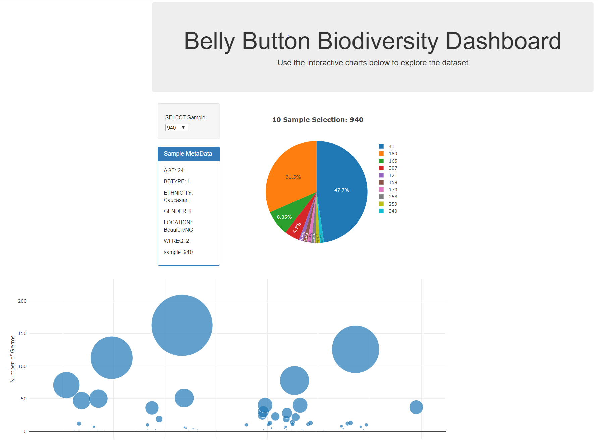

# Belly Button Biodiversity with Plotly.js and Heroku

## Note that I had deleted the app from Heroku in late 2022. However, the code and files may be followed to convey the steps taking for the code and app deployment.

Using Plotly.js and Heroku, the objective is to build an interactive dashboard to explore the [Belly Button Biodiversity DataSet](http://robdunnlab.com/projects/belly-button-biodiversity/).

## Step 1 - Plotly.js

Use Plotly.js to build interactive charts for the dashboard.

* Create a PIE chart that uses data from the samples route (`/samples/<sample>`) to display the top 10 samples.

* Create a Bubble Chart that uses data from the samples route (`/samples/<sample>`) to display each sample.

* Display the sample metadata from the route `/metadata/<sample>`

  * Display each key/value pair from the metadata JSON object on the page

* Update all of the plots any time that a new sample is selected (refresh)

## Step 2 - Heroku
Deploy the Flask app to Heroku.

### ******Note*******
Made an update to the requirements code.
Additionally, this same code may be found in the test_bio repository as there was a test for a different method of deploying to Heroku directly by linking Github in Heroku (compared to git bash.)

## App sample:

